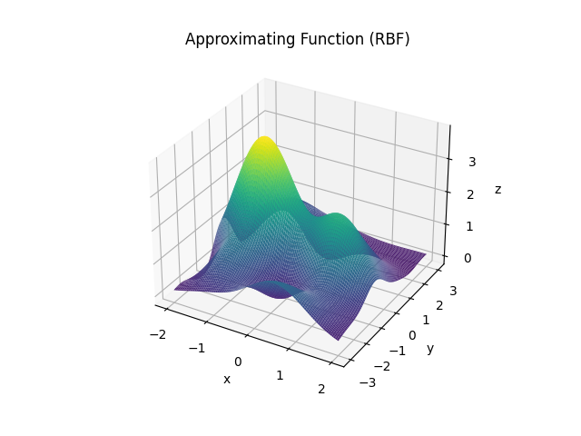

```{r setup, include=FALSE}
knitr::opts_chunk$set(echo = TRUE,fig.pos = "H", out.extra = "")
```

# Introduction {-}

The present work aims to reconstruct a two dimensional function $\textit{F} : \mathbb{R}^2 \rightarrow \mathbb{R}$ from which we don't have the analytic
expression. The reconstruction (in the region [-2;2]x[-3;3]) will be based on 250 points $(x^p;y^p)$ where $y^p$ is defined as $F(x^p)$ in addition with a small random noise. In a nutshell, we will use neural networks based first on Multilayer Perceptron, then on Radial Basis Functions.

# Question 1. (Full minimization)
In this section we construct two shallow Feedforward Neural Network : a MLP and a RBF network. The goal is to find a function $f(x)$ which approximates the true function $F$. The regularized training error will be calculated using the following formula :

\[E(\omega;\pi)=\frac{1}{2P}\sum_{p=1}^{P}(f(x^p)-y^p)^2+\frac{\rho}{2}||\omega||^2\]
where $\omega$/$\pi$ are the parameters/hyperparameters. Observe that the regularization parameter $\rho$ belongs to $\pi$.

## MLP
As activation function for the MLP network we use the hyperbolic tangent

\[g(t)=\frac{e^{2\sigma t}-1}{e^{2\sigma t}+1}\]

where the spread parameter $\sigma$ will also belong to the set of hypeparameters $\pi$.

We searched for the best hyperparameters (N, $\sigma$, $\rho$) by performing a grid search. Our final values for these parameters are (respectively) : 32, 1 and 0.0009. The 3 dimensional plot of the approximating function can be found in the Appendix of the corresponding section and we can already recognize the shape of the function we are looking to reconstruct. In order to analyse how the error behaves compared to the hyperparameters, we decided to plot the testing error depending on every hyperparameter $rho$, $sigma$ and $N$ (plots are in the Appedix). For each hyperparameter, we fix the two other values as the one we found with the grid search. We observe that the three plots have a different behaviour. For hyperparameter $rho$, the error seems to have a maximum peak around 0.0003 and decreases when going smaller or greater. The $sigma$ curve has the opposite behaviour : the lowest error is around 1.5 while it increases if $sigma$ is smaller or greater. The last plot is maybe the most interesting. We observe that the more $N$ increases, the more the error decreases. However at a certain point the error seems to reach a plateau. This can be explained by the fact that a too small number of units  may cause underfitting (the network is too simple). However, the fact that the error does not decrease anymore after a certain point could be the sign that the model is starting to become too complex, with a risk of overfitting if $N$ goes up. Particular values of this task (regarding error and computational time) can be found in the final table 

## RBF
As Radial Basis Function for our network we choose the Gaussian function

\[\phi(||x-c_j||)=e^{-(||x-c_j||/\sigma)^2}\]

As for MLP, the spread parameter $\sigma$ of the function $\phi$ will be added to the list of hyperparameters. After performing a grid search we decide to take as hyperparameters : N=32, $\sigma$=1, $rho$=0.0009.

The plot of the approximating function can be found in the Appendix. We analyse the occurence of overfitting/underfitting when varying the values of our hyperparameters. We decide to use the same method as for MLP, that is, we plot the test error in function of each hyperparameter (see Appendix). When looking at a particular hyperparameter, the value of the other are fixed to the best value that we found. The plot concerning $\rho$ is very clear. Its best value seems to be around 0.0009 and the error increases as we move away from this value. This is easy to explain : if $\rho$ is too small and since it controls the regularization parameter, it will not prevent overfitting as it should. Conversely, if $\rho$ grows too much, it will shrink the weights values and the model selected will underfit, making the testing error grow. In the error plot for $\sigma$ we note that it is minimal at 1, while the error keeps decreasing as N grows until 32.  

## Comparison of the two networks performance

Recall that the majority of the values that we discuss in this section are listed in the summmary table at the end of the report. At first, we can compare the plots of the approximating function obtained and we note that the MLP one seems to fit better with the true function plot, even though the RBF one is not bad. We confirm this first comment when we look at the testing error for both models. The testing error for RBF if approximately 4 times the one that we have for MLP. However, the computational cost for MLP is much higher. The time for optimizing the full MLP network is 10 times greater than for RBF (12.6 seconds compared to 1.10). It is confirmed also by looking at the number of function evaluations (63210 vs 373) and gradient evaluations (490 vs 361). 

# Question 2. (Two blocks methods)

## MLP
In this section we have implemented an Extreme Learning procedure. 


## RBF
Now, we take the same network design as in QUestion 1.2, that is, we take the same hyperparameters : N=32, $\sigma$=1 and $\rho$=0.0009. We then find the optimal weights by minimizing the regularized error using a conjugate gradient method (called "CG" in the python package scipy). We observe the following differences with Full RBF : 

* the train error is greater than for Full RBF (0.042 vs 0.019)
* the test error is greater (0.053 vs 0.023)
* the number of function evaluations is greater (1247 vs 373)
* the number of gradient evaluations is greater (1247 vs 361)
* the optimization time is two times lower (0.53s vs 1.10s)

The plot of the approximating function (see Appendix) is quite similar to the one we had in Question 1.2.

# Question 3. (Decomposition method)

# Bonus : Best Model

# Conclusion : Final Table

When compiling all the results we discuss in this report, we obtain this final table, that sums up the most important information. 
```{r, echo=FALSE}
library(kableExtra)
header = c("Ex", "", "N", "Sigma", 
           "Rho", "Final 
           train error",
           "Final test error", "Initial FOB",
           "Final FOB", "optimization time")
first_line = c("Q1.1","Full MLP",32,1.5,0.0007,0.0029,0.0059,"?","?",12.5911)
second_line = c("Q1.2","Full RBF",32,1,0.0009,0.0194,0.0238,"?","?",1.1027)
third_line = c("Q2.1", "Extreme MLP", 0,0,0,0,0,"?","?",0)
fourth_line = c("Q2.2", "Unsupervised c RBF", 
                32,1,0.0009,0.0429,0.0536,"?","?",0.5324)
fifth_line = c("Q3", "Decomposition Method (RBF)", 
               32,1,0.0009,0.0071,0.0113,"?","?",3.0077)
tab = rbind(header, first_line, second_line, 
            third_line, fourth_line, fifth_line)
kbl(tab, booktabs = TRUE, row.names=F) %>%
kable_styling(latex_options = c("striped", 
                                "scale_down",
                                "HOLD_position"))
```

# APPENDIX (Figures) {-}

## Question 1.1 (MLP) {-}

{width=50%}

{width=50%}

{width=50%}

{width=50%}


## Question 1.2 (RBF) {-}

{width=50%}

{width=50%}

{width=50%}

{width=50%}

## Question 2.1 (Extreme MLP) {-}


## Question 2.2 (unsupervised c RBF) {-}

{width=50%}


